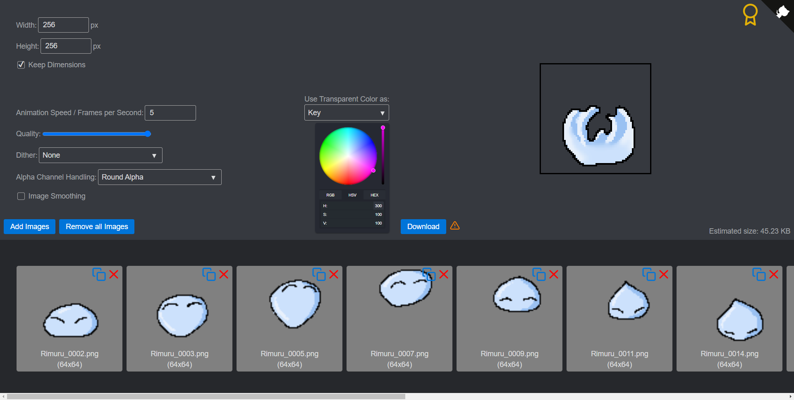

# GifBuilder

[GifBuilder](https://h0rn0chse.github.io/GifBuilder/) is a tools to combine frames into a gif. The images are only saved within the browser cache. The functionality of exporting animated gifs can be quite limited in drawing programs (e.g. Clip Studio Paint). This tool tries to close this gap and simplifies the handling of creating gifs.

* [Usage](#usage)
* [Libraries](#libraries)

## Usage
The standard settings are optimized for images with transparency. You can add the images and rearrange them. Please look [here](#transparent-color) in case you want to have a gif without transparency. You get warnings displayed which give you hints in case the result of your gif does not match your expectation.

### Size and Dimensions
The frames get always resized to the target width and height. By setting `Keep Dimensions` you can toggle between fit to size and stretch.

### Quality
There is no real reason to lower the quality other than to lower the calculation time.

### Dither
This option only has an effect when your frames contain more than 255 colors. You can select the color selection algorithm with this option.

### Alpha Channel Handling
This option controls how to deal with semi-transparent pixels. This tool does not support semi-transparent pixels (although it is somehow possible). It might also happen due to resizing ion the browser that semi-transparent pixels are added.
 * __Round Alpha:__ Rounds the values of the alpha channel. Values lower than 127 gets converted to transparent and values greater than 126 get converted to opaque. This is the best option for most use cases.
 * __Pixel Removal:__ Alpha channel values greater than 0 and smaller than 255 get converted to transparent. This option leads to smaller borders than the initial image provides.
 * __Alpha Removal:__ Alpha channel values greater than 0 and smaller than 255 get converted to opaque. This option leads to bigger borders than the initial image provides.

### Image Smoothing
This option only has an effect when your frames get resized. This option helps to achieve smoother color transitions. In case your frames are pixel art it is better to keep this option off.

### Transparent Color
The effect of the color depends on the selected option. Frames containing no transparent pixels (or the pixels in the selected color) at all get transparent in case the option `key` is selected.
 * __Key:__ The color is used as color key like in a green screen. This color should not be part of the frame. Otherwise these parts get transparent as well.
 * __Background:__ The color is used as background color for frames containg transparent pixels.

## Libraries

 * Gif: [github.com/jnordberg/gif.js](https://github.com/jnordberg/gif.js)
 * ColorPicker: [github.com/ivanvmat/color-picker](https://github.com/ivanvmat/color-picker)
 * Grid: [github.com/haltu/muuri](https://github.com/haltu/muuri)
 * CSS: [github.com/franciscop/picnic](https://github.com/franciscop/picnic)
 * Icons: [github.com/feathericons/feather](https://github.com/feathericons/feather)
 * Github-Corner: [github.com/YuskaWu/github-corner-element](https://github.com/YuskaWu/github-corner-element)